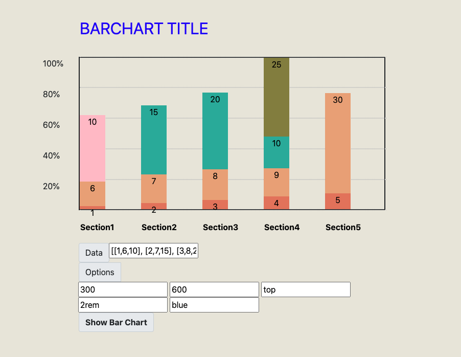
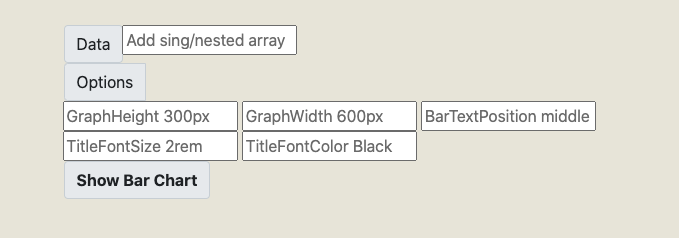
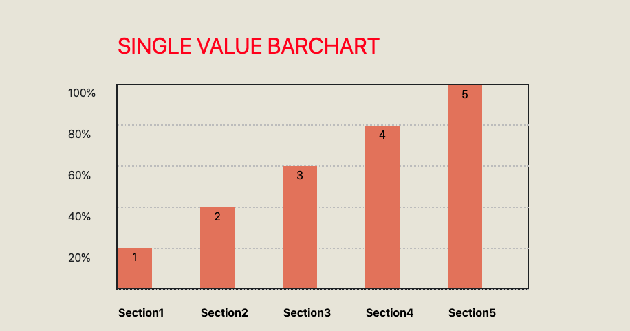
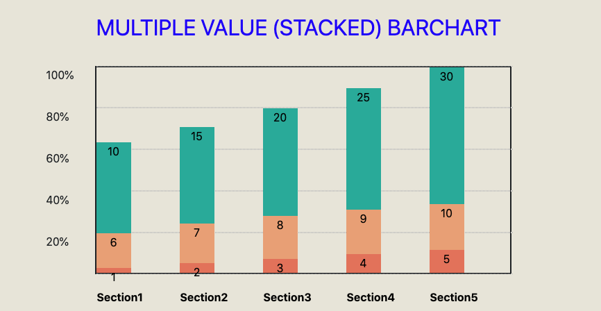
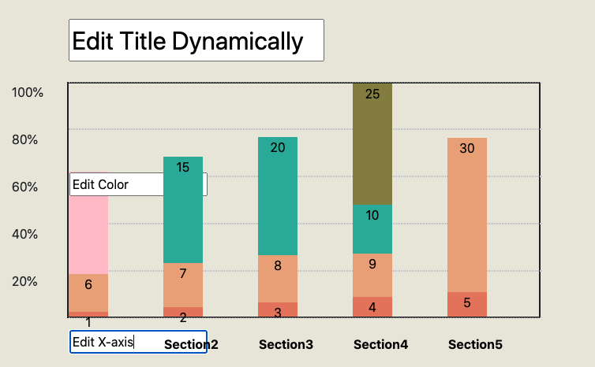

# Bar-Chart-Lib

<h2> About </h2>

This bar chart APP is a tool for rendering bar charts on web page. It takes an array of numbers, and chart properties from user and return a editable chart. This project is under continuos update, and feel free to offer me any recommendations or tips.

<h2> Demo </h2>

You can find this APP here: https://thomaswyee.github.io/Bar-Chart-Project/

<h2> Features </h2>

- It takes an array of numbers.
  for single bar: [[1],[2],[3],[4],[5]];
  
  for stack bars: [[1,6,10], [2,7,15], [3,8,20],[4,9,25],[5,10,30]]) as it input data;
  

- Chart height(H) and width (W) will take number like 300, and the unit is in px.
- The position of values is BarTextPosition, which could be top, centre, or bottom.
- The title font size takes a number and unit (e.g. 2rem).
- The title font color will take any valid css color value.
  

- The title of the bar chart can be set and shown dynamically.
- The color of each individual bar can be set and shown dynamically.
- The X-axis labels can be edited dynamically.  
  

 <h2> Known Issues / Bugs </h2>

The APP need some mordificaiton with the UI/UX, which is under construction right now. I mainly focused on the functionality of the APP, and will change the UI/UX gradually.
